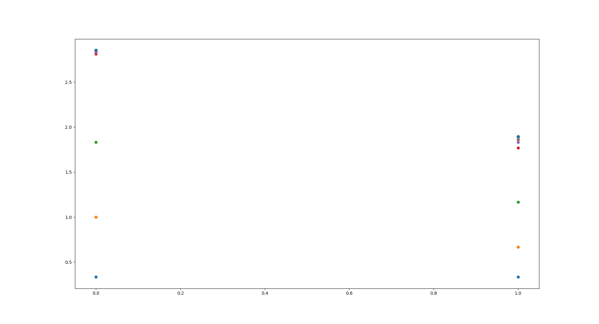

## Problem 1
In this problem, we have to minimize the function $f(x) = x^3\exp(-x^2)$
within the interval $[-2, 2]$.
We compare the number of iterations used by the golden section method
and quadratic interpolation to achieve a good result.

In the golden section method we repeatedly bracket the minimum in a smaller
and smaller interval based on the function value evaluated at two points 
$x_1$ and $x_2$.
We also have two endpoints $a, b$ inside of which we conduct our search.
The points $x_1, x_2$ are selected using the golden ratio such that
the distances between the endpoints and $x_1, x_2$ are equal to the 
golden ratio.
Once the difference between the endpoints is lower than some tolerance 
$\epsilon$, we stop the algorithm.

We compare the golden section method with the quadratic interpolation 
method, which instead tries to use a parabola to find the minimum point.
We calculate a point $x^*$, given by the function 
\begin{equation}
	x^* = \frac{1}{2}\times \frac{f(x_l)(x_m^2 - x_u^2) + f(x_m)(x_u^2-x_l^2) + f(x_u)(x_l^2 - x_m^2)}{f(x_l)(x_m-x_u) + f(x_m)(x_u-x_l)+f(x_u)(x_l-x_m)}
\end{equation}

## Problem 2
For the second and third problem, we want to minimize the function
$$f(x_1, x_2) = (x_1^2 + x_2 -11)^2 + (x_1 + x_2^2 - 7)^2$$
called Himmelblau's function.

For the second problem we use the Hooke-Jeeves method to find the 
function minimum.
This algorithm consists of three parts.
First, for a dimension $i$ and using our current minimum $\boldsymbol{u}$, 
we evaluate the function at $f(\boldsymbol{u} + \nabla\boldsymbol{u})$
and $f(\boldsymbol{u} - \nabla\boldsymbol{u})$ to see which direction
along $i$ we should follow.
Essentially we modify $\nabla u$ along $i$ to see how we should move 
along $i$.

Second, we see if the terminating conditions are met, or whether
the norm of the direction vector is zero.
This means we cannot further minimize the function value by moving
$\boldsymbol{u}$.

Finally, if we can still continue the algorithm, we check how far along
$\nabla\boldsymbol{u}$ we can move.
We evaluate $f(\boldsymbol{u} + \nabla\boldsymbol{u})$ until 
we stop getting lower function values.

## Problem 3
For the third problem we still minimize Himmelblau's function, 
however here we use the downhill simplex method.
With this method, we first define an $n+1$ dimensional shape as our 
simplex, and ensure that by the end, the minimum is contained within
that simple.

For $n=2$ our simplex is a triangle. 
We can perform three operations on our simplex: reflection, expansion
and contraction.

